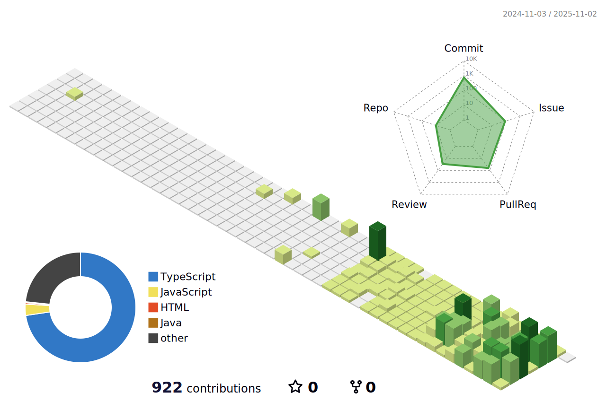

 
 

<h1 align="center">👩‍💻 My GitHub Stats 👩‍💻</h1>

  <picture>
    <source srcset="./profile-3d-contrib/profile-night-view.svg" media="(prefers-color-scheme: dark)" />
    <source srcset="./profile-3d-contrib/profile-gitblock.svg" media="(prefers-color-scheme: light)" />
    
  </picture>

 

  <table align="center">
    <tr>
      <td>
        
      </td>
      <td>
        
      </td>
    </tr>
  </table>

 
 
 

<h1 align="center">👩‍💻 Algorithm 👩‍💻</h1>

  
  

 
 
 

<h1 align="center">👩‍💻 Skill 👩‍💻</h1>

  
  
  
  
  
  
  
  

 
 
 
 

  
  💛 Thanks for visiting my GitHub 💛

